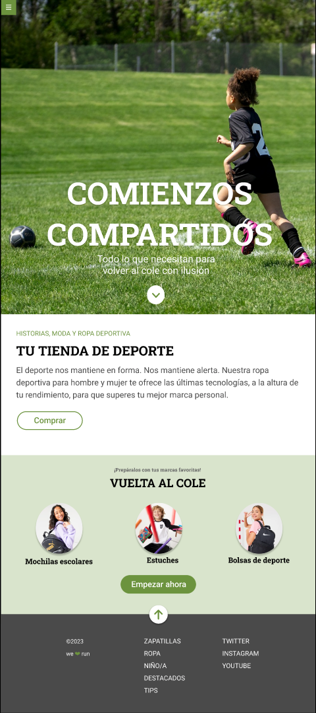

# Módulo 1: Ejercicio de evaluación final

**Enunciado**

El ejercicio consiste en desarrollar una página web de acuerdo a un diseño que os proporcionamos. Hay
que resolver varios puntos:
Usar Sass.
Usar flexbox y CSS Grid.
Usar media queries.
Como extra: resolver algunas interacciones usando transiciones.

**Maquetación**

En primer lugar debéis realizar la maquetación sobre un diseño dado. Este es el diseño que encontraréis en
Zeplin:

**Detalles**

1. El botón de hamburguesa (en la esquina superior izquierda) debe estar fijo en la parte superior de la pantalla y **no** debe desaparecer al hacer scroll. El icono de la hamburguesa debe ser un enlace a la página de Adalab. Este menú de hamburguesa no desplega ningún submenú.

2. Primer módulo (hero - Comienzos compartidos): debe estar maquetado con **Flexbox** y debe ocupar
el alto de la ventana del navegador.

3. Segundo módulo (Tu tienda de deporte): se puede maquetar usando las propiedades de CSS que se
deseen.

4. Tercer módulo (Vuelta al cole): los 3 elementos del listado deben estar maquetados con CSS **Grid** en
todos los tamaños de pantalla en los que se necesite.

4. Cuarto módulo (footer): se debe maquetar usando **flexbox**. Todos los textos de la columna
"ZAPATILLAS" y todos los textos de la columna "TWITTER" **deben ser enlaces** a la página de
Adalab.

**Interacción**

En total, hay varias interacciones de la usuaria que debemos resolver:

. El botón de flecha del primer módulo (el hero) debe enlazar a la sección "Vuelta al cole".

. El botón de flecha que está sobre el footer debe enlazar al inicio de la página (hero).

. Todos los links del pie deben ir a https://adalab.es.

. BONUS a investigar: En el `:hover` de los botones ("Comprar" y "Empezar ahora") se debe incluir una
propiedad transform que dejamos a vuestra elección (y, como idea, hacer la `transform` junto con
`transition`, para investigar la propiedad `transition`).

. BONUS a investigar: hacer una pequeña animación en el botón del footer (para investigar las
propiedades `animatio`).

**Entrega**

La fecha límite de entrega es:
Lunes, 04 de septiembre a las 1400h.
Solo debéis hacer commits y merges en la rama `main` de vuestro repositorio hasta la fecha límite. Si
después de la evaluación queréis seguir trabajando sobre el ejercicio, lo podéis hacer en otra rama y no
debéis mergearla hasta que las profesoras os lo indiquen.

La evaluación solo se considerará terminada cuando:
Esté publicada en GitHub Pages y esté funcionando, para lo cual tendréis que configurar GitHub
Pages en la página de "Settings" de la web de vuestro repositorio y subir el código también a la
carpeta `docs/` del repositorio.
El enlace a GitHub Pages esté en la página página principal del repositorio, en la parte superior
derecha donde pone "About", al lado de la descripción.

Este ejercicio está pensado para que lo realices de forma individual, pero podrás consultar tus dudas con
las profesoras y tus compañeras si lo consideras necesario. Ellas no te darán directamente la solución de tu
duda, pero sí pistas para poder solucionarla. Aún facilitando la comunicación entre compañeras, durante la
prueba no debes copiar código de otra persona ni acceder a su portátil. *Confiamos en tu responsabilidad.*

La evaluación es una buena oportunidad para conocer cómo estás progresando, saber qué temas debes
reforzar durante las siguientes semanas y cuáles dominas. Te recomendamos que te sientas cómoda con el
ejercicio que entregues y no envíes cosas copiadas que no entiendas.

Si detectamos que has entregado código que no es tuyo, que no lo entiendes y no lo puedes defender,
pasarás directamente a la re-evaluación del módulo. **Tu objetivo no debería ser pasar la evaluación sino
convertirte en programadora** y esto debes tenerlo claro en todo momento.

Unos días después de la entrega del ejercicio, tendrás un feedback sobre aspectos a destacar y a mejora en tu ejercicio, y sabrás qué objetivos de aprendizaje has superado de los listados a continuación.

**Criterios de evaluación**

Vamos a listar los criterios de evaluación de este ejercicio. Si no superas al menos el 80% de estos criterios
o no has superado algún criterio clave (marcados con asterisco
*
) te pediremos que realices una reevaluación con el fin de que termines el curso mejor preparada y enfrentes tu primera experiencia
profesional con más seguridad. En caso contrario, estás aprendiendo al ritmo que hemos pautado para
poder afrontar los conocimientos del siguiente módulo.

General

* Usar una estructura adecuada de ficheros y carpetas para un proyecto web, y enlazar bien los
distintos ficheros

* Uso de control de versiones con **ramas** para manejar un proyecto de código.
  

HTML

* Tener el código perfectamente indentado

* Crear código HTML con sintaxis correcta, bien estructurado

* Usar etiquetas HTML semánticas adecuadas para cada pieza de contenido

CSS / Sass

* Tener el código perfectamente indentado

* Crear código Sass con sintaxis correcta, bien estructurado

* Usar algunas características de Sass como variables, anidación y parciales.
Usar código CSS que usa de forma intensiva selectores de clase. No usar selectores de etiqueta ni
de id

* Usar selectores de clase en inglés

* Usar el modelo de caja de CSS de forma adecuada para especificar tamaño, relleno y márgenes

* Usar estilos de texto y fondo para distintos tipos de elementos.
  
* Usar flexbox de forma adecuada para organizar elemento en cajas flexibles

* Usar media queries para que los diseños se ajusten a distintos tamaños de dispositivo

* Usar posicionamiento para emplazar elementos fijos y absolutos en la pantalla.
* Usar CSS grid para emplazar elementos usando una rejilla.
* Usar transiciones CSS para dotar de dinamismo a un proyecto web.
  
**¡Al turrón!**