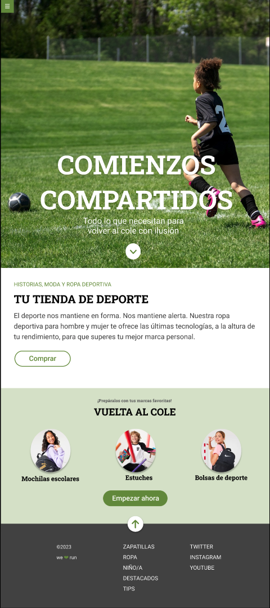

# Módulo 1: Ejercicio de evaluación final

Esta es la resolución del ejercicio propuesto por el profesorado de Adalab para la evaluación del final del módulo 1.

>El ejercio se ha realizado siguiendo los pautas dictadas por el enunciado que se muestra a continuación.

**Enunciado**

El ejercicio consiste en desarrollar una página web de acuerdo a un diseño que os proporcionamos. Hay que resolver varios puntos:
Usar Sass.
Usar flexbox y CSS Grid.
Usar media queries.
Como extra: resolver algunas interacciones usando transiciones.

**Maquetación**

En primer lugar debéis realizar la maquetación sobre un diseño dado. Este es el diseño que encontraréis en
Zeplin:

**Detalles**

1. El botón de hamburguesa (en la esquina superior izquierda) debe estar fijo en la parte superior de la pantalla y **no** debe desaparecer al hacer scroll. El icono de la hamburguesa debe ser un enlace a la página de Adalab. Este menú de hamburguesa no desplega ningún submenú.

2. Primer módulo (hero - Comienzos compartidos): debe estar maquetado con **Flexbox** y debe ocupar
el alto de la ventana del navegador.

3. Segundo módulo (Tu tienda de deporte): se puede maquetar usando las propiedades de CSS que se
deseen.

4. Tercer módulo (Vuelta al cole): los 3 elementos del listado deben estar maquetados con CSS **Grid** en
todos los tamaños de pantalla en los que se necesite.

4. Cuarto módulo (footer): se debe maquetar usando **flexbox**. Todos los textos de la columna
"ZAPATILLAS" y todos los textos de la columna "TWITTER" **deben ser enlaces** a la página de
Adalab.

**Interacción**

En total, hay varias interacciones de la usuaria que debemos resolver:

. El botón de flecha del primer módulo (el hero) debe enlazar a la sección "Vuelta al cole".

. El botón de flecha que está sobre el footer debe enlazar al inicio de la página (hero).

. Todos los links del pie deben ir a https://adalab.es.

. BONUS a investigar: En el `:hover` de los botones ("Comprar" y "Empezar ahora") se debe incluir una
propiedad transform que dejamos a vuestra elección (y, como idea, hacer la `transform` junto con
`transition`, para investigar la propiedad `transition`).

. BONUS a investigar: hacer una pequeña animación en el botón del footer (para investigar las
propiedades `animation`).

